# Baby Buddy Dashboard — User Manual

Welcome. This guide walks through the app the way you'll actually use it, day to day: getting it installed, signing in, logging each kind of entry, running timers, reading your children's cards, setting up reminders, managing more than one child, and making it look the way you like. You don't need any technical background — if you can tap a button, you can use everything here.

If you just want to get going, the [README](../README.md#getting-started-in-5-steps) has a five-step start. This manual is the complete reference for when you want the details.

> Exact wording and colours may vary slightly between app versions and between the two languages (English / Hebrew). The screenshots below use the app's built‑in **demo data** (fictional children "Emma" and "Noah"), so what you see on your own device will show your family's names.

## Contents

1. [Getting the app](#1-getting-the-app)
2. [Signing in](#2-signing-in)
3. [The dashboard](#3-the-dashboard)
4. [Logging an entry](#4-logging-an-entry)
5. [Entry types in detail](#5-entry-types-in-detail)
6. [Timers](#6-timers)
7. [Medications, windows & the breakdown sheet](#7-medications-windows--the-breakdown-sheet)
8. [Notifications & reminders](#8-notifications--reminders)
9. [Multiple children: hiding, groups, colours & schedules](#9-multiple-children-hiding-groups-colours--schedules)
10. [Appearance, language & time format](#10-appearance-language--time-format)
11. [Sharing your instance with another caregiver](#11-sharing-your-instance-with-another-caregiver)
12. [Offline mode](#12-offline-mode)
13. [Signing out](#13-signing-out)
14. [Frequently asked questions](#14-frequently-asked-questions)

---

## 1. Getting the app

Install the app on your Android phone from the **[GitHub Releases](https://github.com/MosheRW/baby-buddy-mobile-dashboard/releases)** page:

1. On your phone, open **[github.com/MosheRW/baby-buddy-mobile-dashboard/releases](https://github.com/MosheRW/baby-buddy-mobile-dashboard/releases)**.
2. Under the latest release's **Assets**, tap the `.apk` file to download it.
3. Open the download. Android will warn that it's from an "unknown source" — allow installs for your browser (**Settings → Install unknown apps**), then tap **Install**.
4. Open **Baby Buddy** and sign in (next section).

To update later, just download and install a newer release's APK over the top — your data and sign‑in stay put.

These release APKs are full builds, so all features work — including notifications, the live timer in the notification shade, and background refresh. (The Expo Go preview and web version are only for trying things out and don't run those native features.)

You'll also need one of:

- A **Baby Buddy** server you (or your family) host, reachable from your phone, **or**
- A **Home Assistant** install running the Baby Buddy add‑on, **or**
- Nothing at all — you can run the app **offline** with data stored only on your phone.

## 2. Signing in

On first launch you'll see the **login screen** with three modes to choose from.

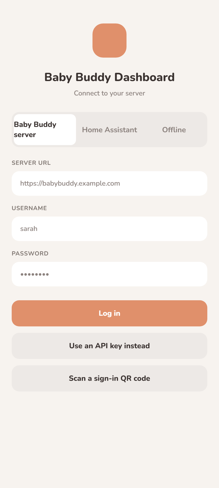

### Baby Buddy (direct server)

1. Tap the **Baby Buddy** segment.
2. Enter your **server URL** (for example `https://baby.example.com`). If you leave off `https://`, it's added for you. If you deliberately type `http://`, a warning appears — your token will travel unencrypted, which is fine on a trusted home network but not over the open internet.
3. Sign in one of two ways:
   - **Username + password** (default): type your Baby Buddy username and password and tap **Log in**. The app exchanges these for an API key behind the scenes and only stores the key.
   - **API key**: tap **Use API key**, paste your key, and log in. (If the password path can't work on your server, the app switches to this automatically.)
4. Alternatively tap **Scan QR** to sign in by scanning a login code another caregiver generated for you (see [Sharing](#11-sharing-your-instance-with-another-caregiver)).

### Home Assistant

1. Tap the **Home Assistant** segment.
2. Enter the **add‑on URL** (the ingress URL for Baby Buddy inside Home Assistant).
3. Paste a **long‑lived access token** from your Home Assistant profile.
4. Tap **Connect**.

### Offline (Local)

1. Tap the **Local** segment.
2. If this is your first time, enter your **baby's name** and **birth date** — this creates the first child on the device.
3. Tap **Start offline**. On later launches this becomes **Continue offline** and simply reopens your on‑device data.

No network is used in this mode; everything stays on the phone.

## 3. The dashboard

The dashboard is home base.

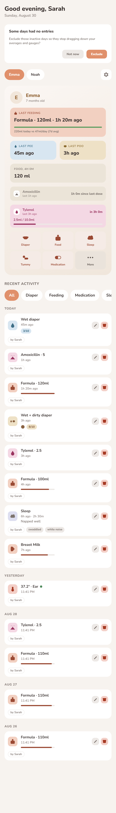

From top to bottom you'll typically see:

- **A greeting** — a friendly, personalized welcome that tucks itself away after you start interacting.
- **A running‑timer strip** — any feeding/sleep/tummy timers currently running, with a live elapsed clock. Tap to stop and turn into an entry.
- **A notification carousel** — recent reminders that fired (or would have), which you can act on or dismiss.
- **One card per child**, each showing:
  - The child's name, avatar, and age.
  - **Time since last** diaper, feed, and sleep.
  - A **24‑hour food summary** and a food‑trend bar.
  - **Medication rows** — what's due, overdue, or eligible again, each tappable.
  - **Quick‑action buttons**: **Diaper**, **Food**, **Sleep**, **Tummy**, **Medication**, and **More** (temperature; notes are reachable from the form's type chips).

Tapping any quick action opens the **Log Entry** form already set to that type and child. Tapping a medication row lets you log a repeat dose or open its breakdown.

Pull down to **refresh** from the server (online modes). Stats tick forward on their own about once a minute.

If you've hidden any children, you'll see a **"Show N hidden children"** chip; tapping it (or shaking the phone, if enabled) reveals them briefly.

## 4. Logging an entry

1. Open the form via a quick action, or from a child card.
2. At the top, pick the **Type** chip — Diaper, Feeding, Medication, Temperature, Tummy time, Sleep, or Note. The fields below change to match. (Switching type mid‑edit keeps what you typed for the other types, so you won't lose work.)
3. Fill in the fields (details per type below).
4. Set the **date and time**. It defaults to now; tap to change.
5. Tap **Save**.

To **edit** an existing entry, open it from the activity feed with the pencil; to **delete**, tap the trash and confirm. If the server refuses a delete (for example a permissions issue), the reason is shown inline rather than logging you out. Use the filter chips at the top of the feed to show just one type.

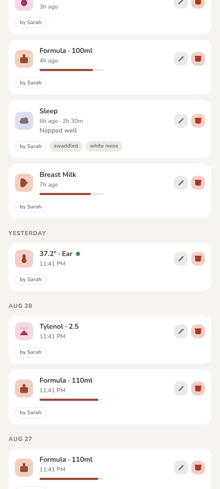

## 5. Entry types in detail

### Diaper

- **Pee** and **Poo** are two independent switches — both can be on at once.
- When Poo is on, pick a **colour** swatch and (optionally) a consistency, and you'll see an amount indicator.

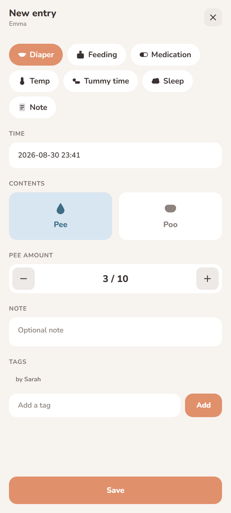

### Feeding

- Choose the **kind**: breast milk, formula, fortified breast milk, or **solid food** (with a solid‑food type).
- The **method** options adjust to the kind (e.g. left/right breast, bottle). Pick one.
- Enter an **amount** (in ml, convertible to grams for solids) **or** a **duration** — the form swaps between them sensibly.
- A **gauge** shows the amount against your per‑child default so you can see "more or less than usual" at a glance. Set that default in Settings.

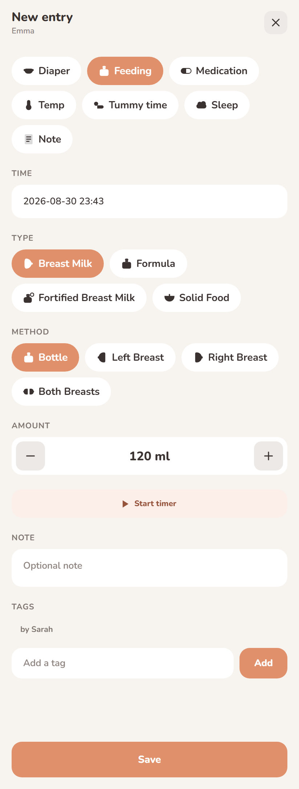

### Medication

- Start typing a **medication name**; recent names are suggested.
- Enter the **dose** and **unit** (mg, ml, drops, puffs, or paste), and optionally the **route** and **body area**.
- Mark it **scheduled** (repeats on an interval) or **as‑needed (PRN)**. For scheduled meds you can set the **repeat interval** and an optional **max dose per 24 hours** (a safety limit — leaving it blank means "say nothing about the limit", it does not clear a previously stated one).

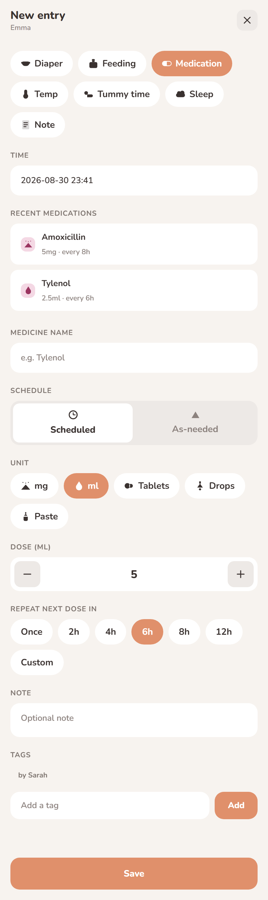

### Temperature

- Enter the reading and, optionally, the **method** (how it was taken).

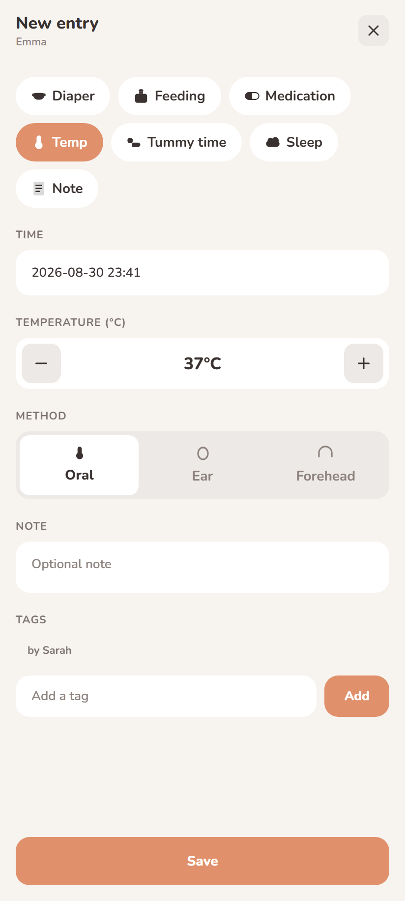

### Tummy time

- Log a duration, with an optional milestone note.

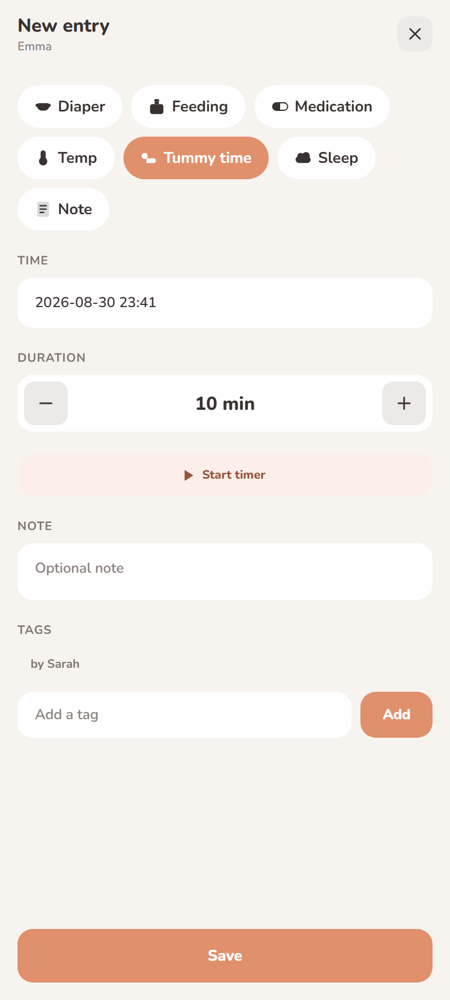

### Sleep

- Log a start and end, or use a **timer**. A **"Still sleeping"** toggle keeps it open‑ended until you stop it.

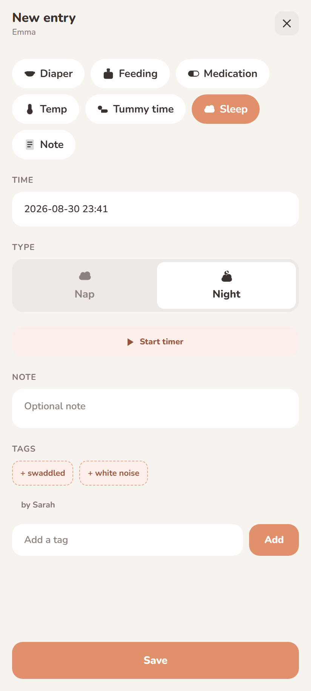

### Note

- A free‑text note attached to the child and time.

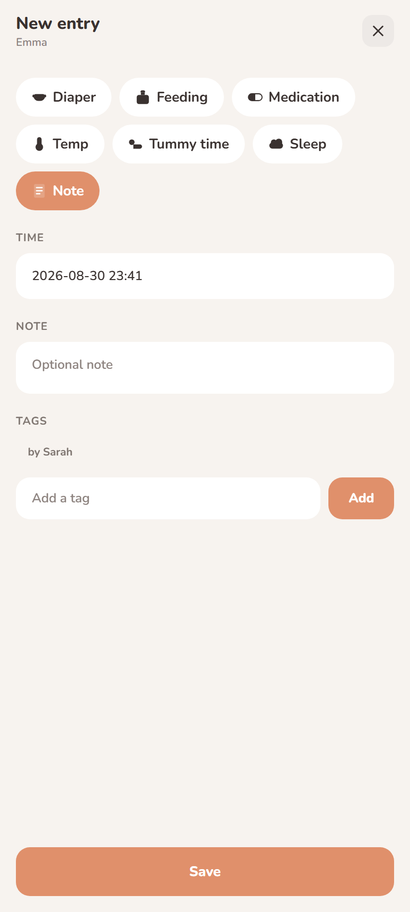

## 6. Timers

For feeding, sleep, and tummy time you can run a live timer instead of typing a duration:

1. In the Log Entry form, tap **Start** on the timer control (or use a quick action that starts one).
2. The timer appears in the dashboard's **running‑timer strip** and keeps counting **even if you close the app**. When online it's backed by the server's own timers, so it's durable and visible to other caregivers.
3. When you're done, **Stop** it — the form opens pre‑filled with the elapsed time so you can adjust and **Save**. Saving a timer‑backed entry stops and clears that timer.

Only one timer per type per child is enforced by the app. If you forget a running timer, a reminder can nudge you (see notifications). While a live timer notification is showing, the "forgotten timer" reminder is suppressed — you can already see it ticking.

## 7. Medications, windows & the breakdown sheet

Each child card shows medication rows with plain‑language timing:

- **"Since last dose 3h ago"**, **"due in 1h 20m"**, or **"overdue by 25m"** for scheduled meds. The phrasing flips to "due in…" only past the halfway point of the interval, so early in a cycle it isn't noisy.
- **"Eligible again"** windows for as‑needed meds.
- A **24‑hour limit** tile when you've set a max dose, opening a **breakdown sheet** with each dose counted. (There's deliberately no single grand total across different medications — adding mg to ml would be meaningless.)

**Tap any medication row** — even before it's due — to log a repeat dose pre‑filled from the last one.

## 8. Notifications & reminders

> Notifications require a proper dev/EAS build. In the Expo Go preview or on web they do nothing.

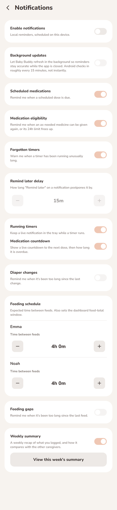

Open **Settings → Notification Settings** to turn categories on/off and tune them:

- **Scheduled medication** — reminders when a scheduled dose is due, with a "before / at / after" timing model.
- **Medication eligibility** — a nudge when an as‑needed med becomes allowed again.
- **Forgotten timer** — before / at / after a timer has been running "too long".
- **Diaper interval** — if it's been a while since the last change.
- **Minimum feed** — if a child hasn't fed within your minimum window.
- **Live timer / medication countdown** — an always‑on notification with a real per‑second ticking clock: counting **up** for a running timer, or **down** to an upcoming scheduled dose (only in the last 15 minutes before it's due, never negative).
- **Weekly summary** — once a week, a recap of what **you** logged over the last seven days and how your share compares to the other caregivers on the same server. Choose the day and hour, or open **"View this week's summary"** any time (it works even with notifications off). Hidden children are excluded from the recap.

Some reminders carry **action buttons** — e.g. "remind later", "add now", "stop/end timer", "remind me on time" — which open the right pre‑filled form or snooze the reminder. The exact buttons depend on the reminder and which timing options you've enabled.

**Freshness & honesty.** Because Baby Buddy is multi‑caregiver, cached data can go stale (another parent logs the change). Every reminder is re‑checked against the server before it's shown, and dropped or corrected if the reason no longer holds. When the server can't be reached, the reminder is still shown but marked with a caveat rather than silently swallowed. An optional **background refresh** toggle (off by default) shrinks the window in which a reminder could be based on stale data while the app is closed. None of this can intercept a reminder that fires while the app is fully killed — that's cleaned up the next time you open the app.

## 9. Multiple children: hiding, groups, colours & schedules

All of this is **on your device only** — Baby Buddy has no concept of hiding or grouping children.

### Quick hide

In **Settings → Children**, flip a child's toggle to hide them from the dashboard.

### Advanced

Open **Settings → Advanced Settings** for:

- **Default visibility for new children** — whether a newly‑appearing child shows or hides by default.
- **Shake to reveal** — enable shaking the phone to briefly reveal hidden children, and set how long the reveal lasts. (Works where the accelerometer is available; the "Show N hidden" chip is always there as a fallback.)
- **Groups** — create groups and assign each child to one. Groups can have their own colour accent and schedule.
- **Per‑child editor** — set a colour **accent** (a curated palette, or **"match phone"** for Material You), assign a group, set a **schedule**, or hide the child.

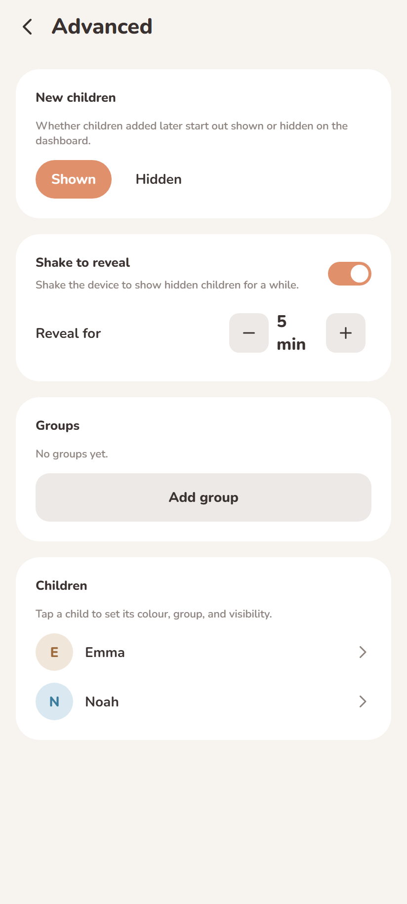

### Schedules

A schedule hides a child during a **daily time window** on chosen **weekdays** (e.g. hide during nursery hours). A window that crosses midnight is supported; leaving weekdays empty means every day. The dashboard re‑checks schedules about once a minute, so a child appears/disappears at the boundary automatically.

### Colours

Colour precedence is: your explicit per‑child pick → the child's group accent → the child's default. Accents drive the avatar, name, and a soft card gradient.

## 10. Appearance, language & time format

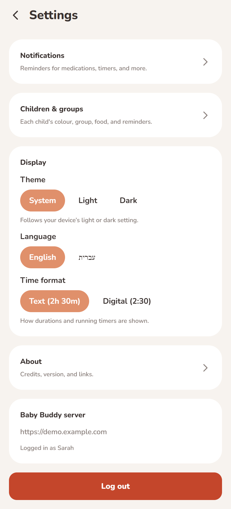

In **Settings**:

- **Appearance** — **Light**, **Dark**, or **System** (follow the phone). On Android 12+, a **Material You** toggle recolours the app's accent from your wallpaper.
- **Time format** — text ("46m ago") or digital.
- **Language** — **English** or **Hebrew** (with right‑to‑left text). Defaults to your Baby Buddy profile language; your pick here overrides it.
- **Stats** — e.g. exclude inactive days from averages.
- **Per‑child default food amount** — the baseline the feeding gauge compares against.

## 11. Sharing your instance with another caregiver

If your account is a **staff/admin** account on the server (offline mode has no server to share), **Settings → Share Instance** lets you invite another caregiver:

1. Open **Share Instance**.
2. Show the generated **QR code** / join code to the other caregiver.
3. On their phone, from the login screen they tap **Scan QR** and scan it to sign in.

This is only available for staff sessions, whether connected directly or through Home Assistant.

## 12. Offline mode

Offline (Local) mode stores children, entries, and timers entirely on your device — no server, no account, no network. It's ideal for a single caregiver on one phone.

Differences from the online modes:

- You manage children directly in **Settings → Children**: rename, change birth date, add, or remove them (at least one child is always kept). There's no server to create them for you.
- There's nothing to share and no notifications validated against a server (they're based purely on your local data).
- Entries you log are stamped as logged by "Me".

You can't convert an offline database into a server one from inside the app; treat them as separate.

## 13. Signing out

**Settings → Log out** ends the session and clears the stored token. In offline mode, logging out returns you to the login screen but your on‑device data remains — choose **Local → Continue offline** to reopen it.

## 14. Frequently asked questions

**Do I need to keep the app open for timers to keep running?**
No. Timers keep counting when the app is closed, and (online) are stored on the server so they survive even a reinstall.

**Why didn't a reminder appear?**
Notifications need a real build (not Expo Go/web), the category must be enabled, and Android must be allowed to show notifications and not aggressively battery‑optimizing the app. Reminders are also suppressed if the server no longer backs them.

**Why is a reminder marked with a caveat?**
The app couldn't reach the server to re‑confirm it, so it showed the reminder anyway rather than risk hiding, say, a medication reminder — but flagged that it might be out of date.

**Can two parents use the same server?**
Yes — that's the normal setup. Each caregiver signs in with their own account. The weekly summary compares your contribution to the others.

**My writes fail but reads work.**
Your account may be read‑only (only `view` permissions on the server). Reads load fine; the first create/edit/delete is refused by the server with the reason shown inline. Ask your server admin for the needed permissions.

**Is my password stored?**
No. A password is used once to obtain an API token, then discarded; only the token is kept (in secure storage).

---

*For developer setup, build instructions, and architecture, see [`DEVELOPMENT.md`](DEVELOPMENT.md). For an overview and install links, see the [`README`](../README.md).*
